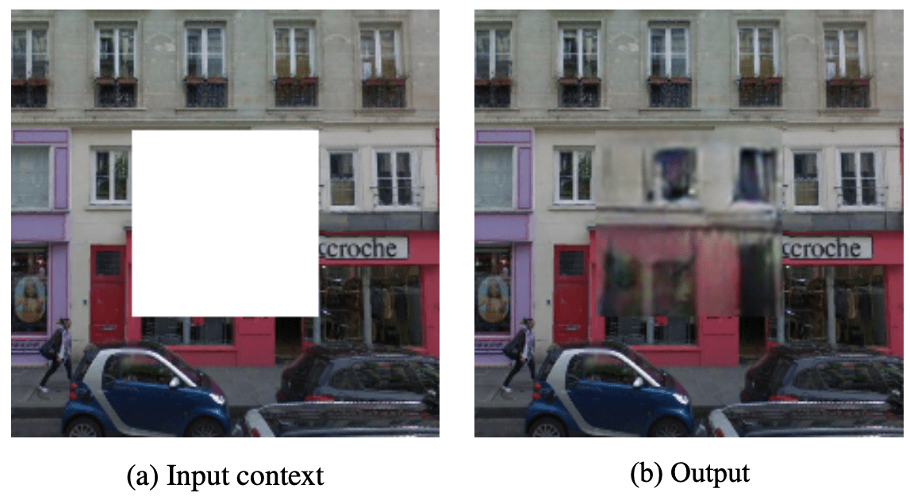
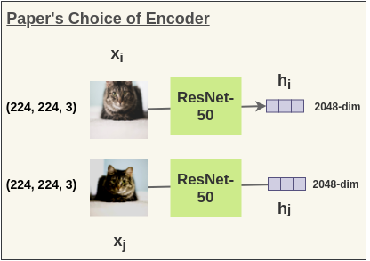

# Implementation of A Simple Self-supervised Algorithm for Contrastive Learning in Visual Representations 

## Motivations

Getting AI to learn like a new-born baby is the goal of self-supervised learning. Scientists are working on creating better AI that learns through self-supervision, with the pinnacle being AI that could learn like a baby, based on observation of its environment and interaction with people. This would be an important advance because AI has limitations based on the volume of data required to train machine learning algorithms (**scalability**), and the brittleness of the algorithms when it comes to adjusting to changing circumstances (**Improved AI capabilities**). Some early success with self-supervised learning has been seen in the natural language processing used in mobile phones, smart speakers, and customer service bots. Training AI today is time-consuming and expensive. The promise of self-supervised learning is for AI to train itself without the need of external labels attached to the data in which human intervention and supervision are both involved. In other words, the self-supervised learning aims to further enable machines to come up with a solution automatically - completely relying on their own capabilities without any interference (**Understanding how the human mind works**). As we understand this self-learning process better, we will be able to get closer to create models that think more similar to humans. 

   Fig. 1                     |   Fig. 2
:----------------------------:|:------------------------------:
 | 

## Differences among Supervised, Unsupervised, Semi-supervised and Self-supervised Learnings

  Supervised | Unsupervised | Semi-supervised | Self-supervised 
:-----------:|:------------:|:---------------:|:---------------:
pure (type-1) | pure (type-2) | hybrid of type-1 and type-2 | subset of type-2
train labeled input | train unlabeled input | train labeled input | train unlabeled input
predict labeled input | no predictions | predict unlabeled input | predict unlabeled input
test labeled input | no testing | test labeled input | test unlabeled input
regression | clustering, market segmentation | look-alike segmentation | regression, image segmentation
binary or multiple classification | grouping, association, dim. reduction | binary classification | binary or multiple classification

## Comparison of Advantages and Disadvantages in Self-supervised Learning 

Merits           | Shortages
:---------------:|:----------------------:
scalability | intensity 
capability | inaccuracy
human-alike | irreproducity

## Applications in Self-supervised Learning

* Healthcare
* Autonomous driving
* Chatbots
* Injury and illness prevention
* Climate change
* Vaccine development
* Behavior science

## What's the contrastive learning? 

Contrastive learning is a self-supervised, task-independent deep learning technique that allows a model to learn about data, even without labels. Contrastive learning attemps to teach machines how to differentiate similar objusts from dissimilar ones without the need of manual annotation (aka: human supervision as required in supervised learning). In brief, it's an approach toward learning data without labels. SimCLR is an example of a contrastive learning approach that learns how to represent images such that similar images have similar representations, thereby allowing the model to learn how to distinguish between images. The pre-trained model with a general understanding of the data can be fine-tuned for a specific task such as image classification when labels are scarce to significantly improve label efficiency, and potentially surpass supervised methods. 

  Fig. 3                     |   Fig. 4
:----------------------------:|:------------------------------:
 | 

First thing, our machine turns each input into a representation. Afterward, the similarity between a pair of representations is computed. 

 Fig. 5                     |   Fig. 6
:----------------------------:|:------------------------------:
 | 

## What's the SIMple framework for Contrastive Learning of visual Representation (SimCLR)? 

With the rules of contrast learning, SimCLR provides a model that learns representations by maximizing the agreement between randomly transformed views of the same data sample through minimizing the contrast loss in the latent space.

## Principles of SimCLR [research paper (Chen et. al)](https://arxiv.org/abs/2002.05709)

Suppose we have a training corpus of millions of unlabeled images.

### Data Augmentation

First, we generate batches of 8,192 raw images. We perform any combination of the following augmentations randomly: `crop (or resize), flip, color distortion (or jitter), grayscale`. We do this twice per image in our batch. Thus, for a batch size of 2, we get 2 * N (N=2) = 2 * 2 = 4 total images.

### Base Encoder

We then use our DNN as baseline behaving as an encoder, h = f(x), to extract vector representations from augmented images (`x`). The encoder used is generic and replaceable with other architectures such as [ResNet-50](https://arxiv.org/abs/1512.03385), VGG-16, VGG-19 and so on. ResNet-50 architecture is selected as the ConvNet encoder. The output is a 2048-dimensional vector h, which is commonly shared by each positive pair of two augmented images.

### Projection Head

### Contrastive Loss Function

### Improving performance

## Requirements:
  
  * jupyterlab==2.0.1
  * Keras==2.3.1
  * tensorflow==2.1
  * pandas==0.22.0
  * opencv-python==4.2.0.32
  * scikit-learn==0.23.1
  * scipy==1.4.1
  * numpy==1.18.1
  * DateTime==4.3
