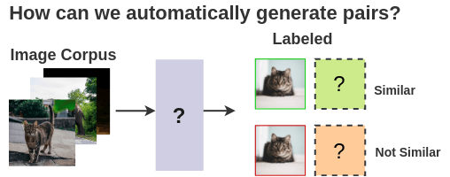

# Implementation of A Simple Self-supervised Algorithm for Contrastive Learning in Visual Representations 

   Fig. 1                     |   Fig. 2
:----------------------------:|:------------------------------:
 | 

## Differences among Supervised, Unsupervised, Semi-supervised and Self-supervised

  Supervised | Unsupervised | Semi-supervised | Self-supervised 
:-----------:|:------------:|:---------------:|:---------------:
pure (type-1) | pure (type-2) | hybrid of type-1 and type-2 | subset of type-2
train labeled input | train unlabeled input | train labeled input | train unlabeled input
predict labeled input | no predictions | predict unlabeled input | predict unlabeled input
test labeled input | no testing | test labeled input | test unlabeled input
regression | clustering, market segmentation | look-alike segmentation | regression, image segmentation
binary or multiple classification | grouping, association, dim. reduction | binary classification | binary or multiple classification

## What's the contrastive learning? 

Contrastive learning attemps to teach machines how to differentiate similar objusts from dissimilar ones. 

  Fig. 3                     |   Fig. 4
:----------------------------:|:------------------------------:
 | 

## Requirements:
  
  * jupyterlab==2.0.1
  * Keras==2.3.1
  * tensorflow==2.1
  * pandas==0.22.0
  * opencv-python==4.2.0.32
  * scikit-learn==0.23.1
  * scipy==1.4.1
  * numpy==1.18.1
  * DateTime==4.3
